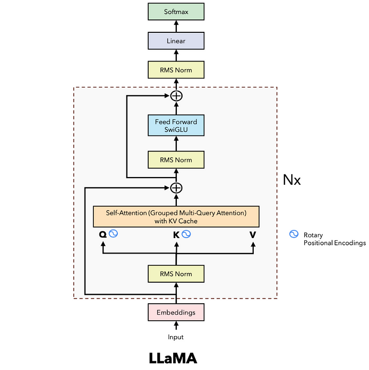
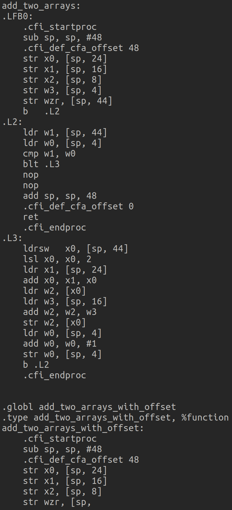
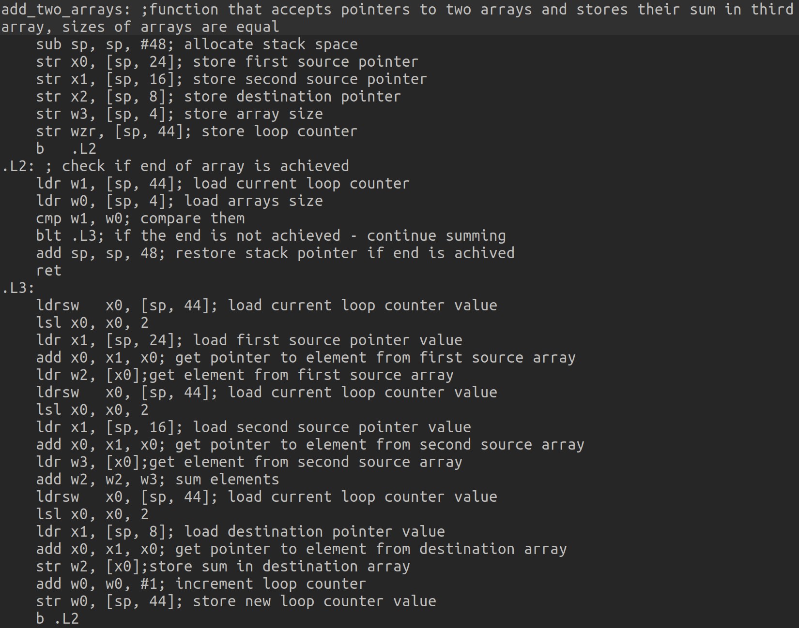
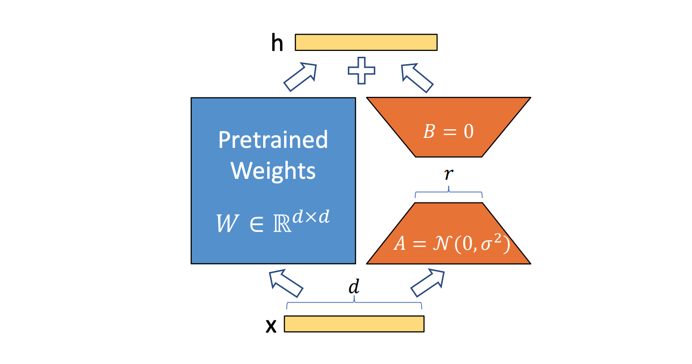

# Code Llama fine tune

This is a repository describing the Code Llama fine tune approach for the task of embedding aarch64 assembly

## Code Llama architecture & embedding extraction method

The following image depicts the architecture of Code Llama:



Code Llama is a decoder-only model.

When asked to generate, Code Llama behaves the following way:
It generates embeddings for the input sequence. Then, it generates a new token, based on embedding of the last token of sequence. Then, the starting sequence together with new generated token is taken as input sequence. The process continues, until it generates an end-of-sequence token.

An assumption was made, that if the model uses embedding of last token to generate new one, it should mean the embedding of last token incapsulates all information about input sequence, so it can be used as embedding of input sequence.

## Zero-shot experience

The first approach for creating embedding from Aarch64 assembly, is to just use pre-trained Code Llama as it is, without any finetuning

To check model's understanding of armv-8 assembly, a simple test was made: to complete a function that adds two arrays and stores the result in the third one:

C source code:

```
void add_two_arrays(int* src1, int* src2, int* dst, int size)
{
    for (int i = 0; i < size; i++)
        dst[i] = src1[i] + src2[i];
}
```

Resulting assembly:
```
add_two_arrays:
.LFB0:
	.cfi_startproc
	sub	sp, sp, #48
	.cfi_def_cfa_offset 48
	str	x0, [sp, 24]
	str	x1, [sp, 16]
	str	x2, [sp, 8]
	str	w3, [sp, 4]
	str	wzr, [sp, 44]
	b	.L2
.L2:
	ldr	w1, [sp, 44]
	ldr	w0, [sp, 4]
	cmp	w1, w0
	blt	.L3
	nop
	nop
	add	sp, sp, 48
	.cfi_def_cfa_offset 0
	ret
	.cfi_endproc
.L3:
	ldrsw	x0, [sp, 44]
	lsl	x0, x0, 2
	ldr	x1, [sp, 24]
	add	x0, x1, x0
	ldr	w2, [x0]
	ldrsw	x0, [sp, 44]
	lsl	x0, x0, 2
	ldr	x1, [sp, 16]
	add	x0, x1, x0
	ldr	w1, [x0]
	ldrsw	x0, [sp, 44]
	lsl	x0, x0, 2
	ldr	x3, [sp, 8]
	add	x0, x3, x0
	add	w1, w2, w1
	str	w1, [x0]
	ldr	w0, [sp, 44]
	add	w0, w0, 1
	str	w0, [sp, 44]
```

Part from which the model will be prompted to generate:

```
add_two_arrays:
.LFB0:
    .cfi_startproc
    sub sp, sp, #48
    .cfi_def_cfa_offset 48
    str x0, [sp, 24]
    str x1, [sp, 16]
    str x2, [sp, 8]
    str w3, [sp, 4]
    str wzr, [sp, 44]
    b   .L2
.L2:
    ldr w1, [sp, 44]
    ldr w0, [sp, 4]
    cmp w1, w0
    blt .L3
    nop
    nop
    add sp, sp, 48
    .cfi_def_cfa_offset 0
    ret
    .cfi_endproc
.L3:
    ldrsw   x0, [sp, 44]
    lsl x0, x0, 2
    ldr x1, [sp, 24]
    add x0, x1, x0
    ldr w2, [x0]
```

So, it needs in main cycle .L3 to load the next element from second pointer, stored in sp + 16, calculate the sum of loaded elements and store them in third pointer, which is in sp + 8

The resulting output:



For comparison, if to add following guiding comments into the code:

```
add_two_arrays: ;function that accepts pointers to two arrays and stores their sum in third array, sizes of arrays are equal
    sub sp, sp, #48; allocate stack space
    str x0, [sp, 24]; store first source pointer
    str x1, [sp, 16]; store second source pointer
    str x2, [sp, 8]; store destination pointer
    str w3, [sp, 4]; store array size
    str wzr, [sp, 44]; store loop counter
    b   .L2
.L2: ; check if end of array is achieved
    ldr w1, [sp, 44]; load current loop counter
    ldr w0, [sp, 4]; load arrays size
    cmp w1, w0; compare them
    blt .L3; if the end is not achieved - continue summing
    add sp, sp, 48; restore stack pointer if end is achived
    ret
.L3:
    ldrsw   x0, [sp, 44]; load current loop counter value
    lsl x0, x0, 2
    ldr x1, [sp, 24]; load first source pointer value
    add x0, x1, x0; get pointer to element from first source array
    ldr w2, [x0];get element from first source array
```

The output is following:



As it is apperant, without guiding comments model can generate just syntactically correct armv-8 assembly, but not the one, which actually completes the function

So, there is a need to fine-tune the model

## Dataset

Because we want to teach the model how to complete the given piece of assembly code, all we need is just code in Aarch64 assembly as input, with the target being the same aarch64 assembly code. So, the finetuning actually is unsupervised in this case, and the dataset is not a big problem: any large scale C code base compiled to Aarch64 assembly will suit the needs.

## Fine tuning approach:

Because of size of model (7B parameters), the basic finetuning approach, which is to train the whole model on some dataset is unfeasible. So, the PEFT approaches should be used.

One of the most successful recently created approach is LoRA: [Low Rank Adaption](https://arxiv.org/abs/2106.09685). The authors of this approach were inpired by the [Intrinsic Dimensionality Explains the Effectiveness of Language Model Fine-Tuning](https://arxiv.org/abs/2012.13255), which states that in over-parameterized models, the parameters reside on a low intrinsic dimension, and supposed, that when fine-tuning the whole models, the additionally learnt parameters also reside in low intrinsic dimensions.

So, the basic idea in LoRA approach is as follows:

For each linear layer with dimensions (input\_ddim, output\_dim) two new matrices are created: A and B, which have (input\_dim, rank) and (rank, output\_dim) dimensions correspondingly. Those matrices A and B are trained during fine-tuning, while the original weights are frozen. The rank is a hyperparameter of LoRA approach



This approach is flexible: the value of rank hyperparameter can be set anywhere from 1 to min(input\_dim, output\_dim), (the last being equivalent to full model finetuning), so it can be chosen appropriately for expected model perfomance and resources at hand

Futhermore, during finetuning the language model head part of Code Llama can be unfrozen, so that it does not interfere with finetuning the backbone. For example, the backbone, if the language head is frozen, might learn not how to create good embedding of assembly, but to create embedding of assembly, from which the frozen head can generate correct code, which is not what we need.

As for other PEFT approaches, such as P-Tuning or Prefix-tuning: in the LoRA paper it was shown that LoRA approach gives better results. Moreover, the implementation of those approaches in popular python library for finetuning seems to have some issues ([Corresponding github issue](https://github.com/huggingface/peft/issues/869)), which means that those approaches should be implemented by wrapping appropriatly the source code from authors of papers, which creates technical difficulties, and therefore was not researched.

